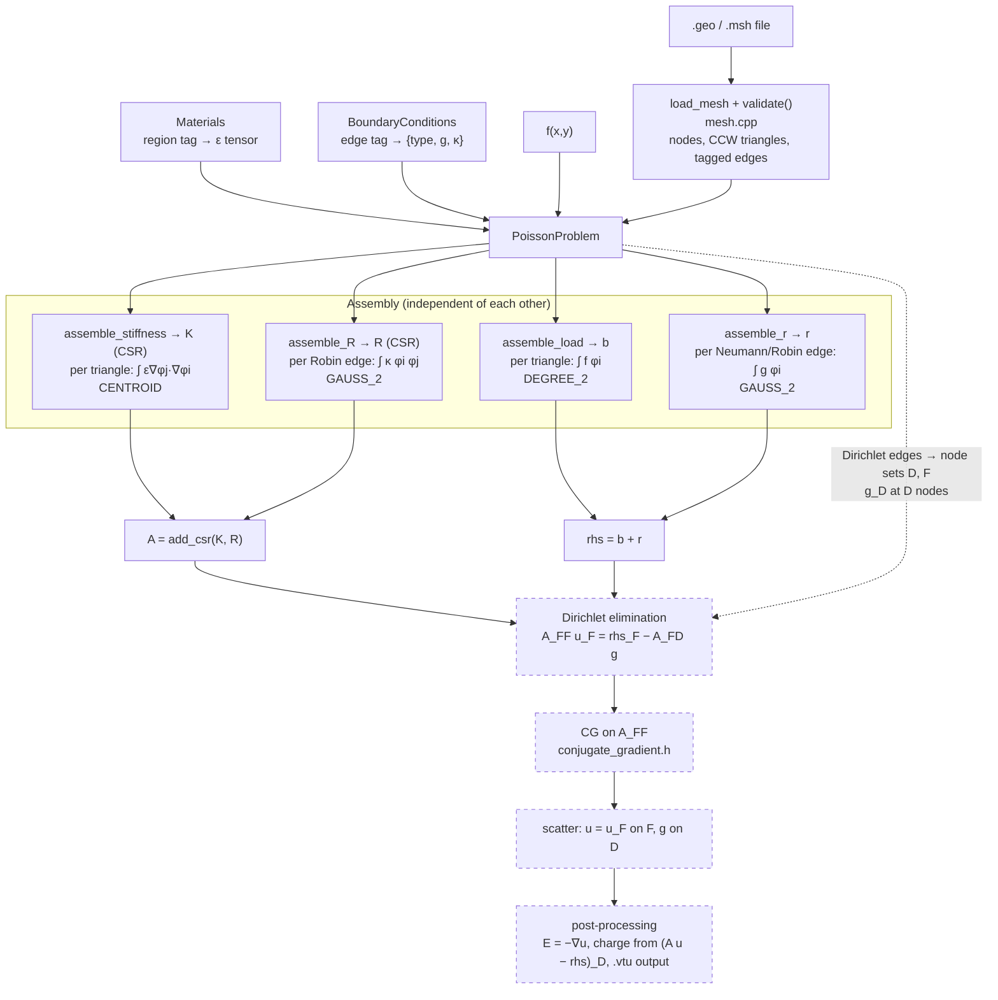

# 2D FEM Solver

A 2D finite element solver written from scratch in C++, with a CUDA port for the RTX 5070 planned.

The target is electrostatics, `-div(eps grad u) = rho`. That's the Poisson problem with a per-region ε tensor, so the matrix stays real and SPD and CG works on it. I follow Larson & Bengzon, mostly §4.5 for the boundary conditions.

## Where it's at

| | |
|---|---|
| Mesh | `load_mesh` reads `.geo`/`.msh` through gmsh, `validate()` checks it and flips triangles to CCW |
| Sparse | triplets → CSR (`to_csr`), CSR + CSR (`add_csr`) |
| Quadrature | triangle: `CENTROID`, `DEGREE_2`. edge: `MIDPOINT`, `GAUSS_2` |
| Assembly | K, b, Robin matrix R, boundary vector r, all tested |
| **Next** | Dirichlet elimination, CG, manufactured solution test |

## Pipeline

Solid boxes are done and tested, dashed ones aren't written yet. The four assembly routines don't depend on each other. Everything after them runs in order.



Every matrix gets built the same way: each element or edge pushes its local entries as (row, col, value) triplets, and `to_csr` sums the duplicates.

## The math, short version

**Problem.** `−∇·(a∇u) = f` in Ω, with each boundary edge tagged as one of:
- Dirichlet: `u = g_D`
- Neumann: `−n·(a∇u) = g_N`
- Robin: `−n·(a∇u) = κ(u − g_D) − g_N`, rewritten as `κu − g` with `g = κ g_D + g_N`

**Weak form.** Multiply by a test function v and integrate by parts. The boundary term `∫ (n·a∇u) v` is where the BCs come in:
- On Neumann and Robin edges the flux is known, so it becomes `∫ g v` (the vector r) plus `∫ κ u v` (the matrix R).
- On Dirichlet edges the flux is unknown, but it never shows up, because we only test with v that are 0 there.

**Splitting the nodes.** D is every node on a Dirichlet edge (corners included), F is everything else. Write

    u_h = Σ_{j∈F} ξ_j φ_j + Σ_{j∈D} g_j φ_j

The second sum is known. Testing with the free φ_i only gives one equation per free node:

    K_FF ξ_F = b_F + r_F − K_FD g,    K = A + R

So:
- b and r only keep their free rows.
- g_D enters only through `−K_FD g`, the coupling between free nodes and their Dirichlet neighbours. That's how the boundary values reach the interior.
- CG gets `K_FF` and the right-hand side above, nothing else. `K_FF` is SPD. The full K isn't even the right system, and without Dirichlet nodes it's singular (constants are in its null space).
- The solution is `ξ_F` on F and `g` on D. The DD and DF blocks aren't needed for this.

**Why Dirichlet is per node.** `g_D` lives on the edges, e.g. `u = cos θ` around a circle. But u_h is linear along each boundary edge, so it can't match `cos θ` exactly, only its two end values. We use the interpolant `g_j = g_D(x_j)`. The error is O(h²), the same as P1 inside the domain, so the convergence rate doesn't suffer. It's the same kind of error as meshing the circle with straight edges.

**Quadrature.** The integrands are polynomials, so a rule that is exact for their degree gives the exact integral:
- `ε∇φj·∇φi` is constant per triangle: `CENTROID` (1 point).
- `f φi` with linear f is quadratic: `DEGREE_2`.
- `κ φi φj` on an edge is quadratic, or cubic if κ is linear: `GAUSS_2`. Two points at `t = ½ ± 1/(2√3)`, weights ½. With 2 positions and 2 weights you can match `1, t, t², t³`, so it's exact up to cubics. Midpoint only gets up to linear.
- On an edge `φ0 = 1 − t`, `φ1 = t`, where t is the same parameter the quadrature uses. So no square roots are needed.

## Notes for later

- **Surface charge σ on an interface.** It makes the normal flux jump, `[n·ε∇u] = −σ`. In the weak form this is just `∫_Γ σ φ_i` added to b on the interior interface edges, the same as a Neumann load. P1 already allows kinks across element edges, so nothing else changes as long as the mesh has edges along Γ. Plan: a `SurfaceCharge` BC type handled like Neumann in `assemble_r`. Surface currents in magnetostatics (A_z) work the same way.
- **Point charges.** `b_i += q φ_i(x0)`, which is just q at a mesh node.
- **Flux / charge on the electrodes.** Once u is known, the rows we threw away, `(K u − rhs)_D`, give the discrete normal flux. Summing it over one plate gives Q, then `C = Q/V` without differentiating u.
- **Untagged interfaces.** `bcs.at(tag)` throws for a tagged edge with no BC entry (e.g. a material interface). Either skip missing tags or give every tag an entry.
- **`add_csr`** re-sorts through triplets, O(nnz log nnz). Swap it for a per-row merge once it's in a time loop like `K + Δt M`.

## Decisions

- **`double` everywhere.** `float` runs out of precision in a convergence study and makes correct code look broken.
- **CCW winding**, enforced by `validate()`. The Jacobian sign is then meaningful and outward normals are well defined.
- **Boundary stored as tagged edges**, not nodes. Neumann and Robin integrate along edges, and Dirichlet nodes can be collected from edges anyway.
- **Physics lives outside `Mesh`.** `Materials` maps region tag → ε, `BoundaryConditions` maps edge tag → BC. One mesh can serve many problems, which a convergence sweep needs.
- **ε is a symmetric 2×2 tensor** stored as `(xx, yy, xy)`. Anisotropic materials cost nothing extra. It has to stay SPD or CG stops working.
- **The mesh has to conform to material interfaces**, i.e. element edges run along them. gmsh does this when the regions are separate surfaces sharing a curve.
- **Outer boundary is artificial.** Space is unbounded, so there's a truncation boundary with its own tag.
- **Don't assume `numDofs() == numNodes()`.** True for P1, false for P2 or vector problems.

## Layout

```
mesh/          Mesh, load_mesh, validate (gmsh.h is vendored)
linalg/        csr.h, conjugate_gradient.h
materials/     region tag → ε
problem/       PoissonProblem, BoundaryConditions
solver/        electrostatics/assembly.h
helpers.h      area, hat gradients/values, small 2D tensor ops
quadrature.h   triangle and edge rules
meshes/        cap.geo/.msh (cylindrical capacitor)
tests/         doctest suite, fixtures in tests/data/
```

## Build and test

```bash
make          # ./fem, runs the capacitor
make test     # builds and runs ./run_tests
make clean
```

The Makefile links against the gmsh from the venv (`.venv/lib`) and makes the `libgmsh.so` symlink if it's missing. It needs `-fvisibility=hidden`, otherwise gmsh's inline `initialize` interposes libgmsh's own symbol and recurses forever.

```bash
source .venv/bin/activate     # numpy, scipy, matplotlib, meshio, gmsh, pytest
```

Also installed: gcc 11.4, CUDA 13.3, Eigen 3.4 (only as an oracle, not to build on). The 5070 is Blackwell, so it's `-arch=sm_120`.

## Testing

Every test checks against an answer worked out by hand:
- K on a single triangle, symmetry, zero row sums
- the patch test (`K u = 0` at interior nodes for linear u)
- b, R and r against exact integrals, e.g. `1ᵀR1` = perimeter, `r·y = ∫ xy ds`

Still to do: a manufactured solution. Pick u, compute f from it, solve, and check that the L² error drops ~4× per halving of h. A wrong rate points at the bug:
- rate ≈ 1 instead of 2: quadrature, or Dirichlet applied in a way that breaks symmetry
- rate ≈ 2 but the error plateaus: CG tolerance too loose
- no convergence at all: assembly or connectivity

scipy (`spsolve`) is the other oracle. If it disagrees with my CG, the solver is broken. If it's also wrong, the assembly is.

## Traps

- gmsh node tags start at 1, C++ at 0. Subtract in exactly one place.
- Duplicate (i,j) entries from neighbouring elements have to be summed, not overwritten.
- Zeroing a Dirichlet row but not its column breaks symmetry and CG stalls. Eliminating properly avoids this.
- Pure Neumann has constants in the null space, so u is only unique up to a constant.
- No exact float compares in tests.
- Unsaved files don't get tested.

## Roadmap

1. **CPU solver.** Dirichlet elimination, CG, manufactured solution test. Then Jacobi PCG, maybe IC(0) to compare.
2. **Benchmarks.** Meshes of growing size. Log assembly time, iterations, time per iteration. Dump K_FF and b as Matrix Market so GPU experiments and scipy can use them standalone.
3. **GPU v1.** Same CG loop on cuBLAS + cuSPARSE, checked against the CPU.
4. **GPU v2.** My own axpy, dot and SpMV (1 thread / 4 to 8 threads / warp per row), timed against v1.
5. **GPU v3.** Fused kernels, Jacobi on GPU, CUDA Graphs, device pointer mode.
6. **Later.** AMG, matrix-free, time domain waves (`M ü + K u = 0`), complex Helmholtz.

SpMV is bandwidth bound, so the number to watch is achieved GB/s against the 5070's ~670 GB/s, not FLOPS.

Keep CG written only against `spmv`, `dot`, `axpy`, `nrm2` and a preconditioner `apply(r) -> z`. Then porting means swapping implementations, not logic.

## Things to explore

- **Preconditioners:** Jacobi (trivial, parallel), IC(0) (strong on CPU, sequential on GPU), polynomial/Chebyshev and sparse approximate inverse (only SpMVs, GPU friendly), multigrid/AMG (iterations stop depending on h).
- **Sparse formats:** CSR vs ELL / SELL-C-σ vs BSR (for vector problems). cuSPARSE has all of them, so they can be compared without writing kernels.
- **Node reordering** (reverse Cuthill-McKee) for cache locality of x in SpMV.
- **Matrix-free** K·x straight from element data. Break-even at P1, wins from P2 up.
- **Waves:** time domain (real, explicit, lumped M, CFL) vs frequency domain (complex, indefinite, GMRES/BiCGSTAB, PML).
- **Complex:** `std::complex<double>`, cuBLAS `Z` routines, cuSPARSE `CUDA_C_64F`, COCG for complex symmetric systems.

## Reading

**FEM and solvers**
- **Larson & Bengzon**, *The Finite Element Method: Theory, Implementation, and Applications*. Ch. 1 to 4, the main reference.
- **Shewchuk**, *An Introduction to the Conjugate Gradient Method Without the Agonizing Pain*. Read §1 to 8 before writing CG. <https://www.cs.cmu.edu/~quake-papers/painless-conjugate-gradient.pdf>
- **Saad**, *Iterative Methods for Sparse Linear Systems*, for preconditioning. <https://www-users.cse.umn.edu/~saad/IterMethBook_2ndEd.pdf>
- **Briggs, Henson & McCormick**, *A Multigrid Tutorial*. Short, the way into multigrid.
- **Jin**, *The Finite Element Method in Electromagnetics*, for the EM and wave side.

**GPU**
- **Mark Harris**, *Optimizing Parallel Reduction in CUDA* (slides). Step by step dot product.
- **Bell & Garland**, *Implementing Sparse Matrix-Vector Multiplication on Throughput-Oriented Processors* (2009). CSR scalar/vector, ELL, HYB.
- **Cecka, Lew & Darve**, *Assembly of finite element methods on graphics processors* (2011), if assembly ever moves to the GPU.
- cuBLAS docs (Level-1) and cuSPARSE docs (Generic API, `cusparseSpMV`).

**Code to read (after writing my own)**
- NVIDIA `cuda-samples`: the `conjugateGradient` sample.
- NVIDIA `CUDALibrarySamples`: small cuSPARSE/cuBLAS examples.
- **Ginkgo**: open source, many SpMV formats, CG and preconditioners on GPU.
- **AmgX**: NVIDIA's AMG, as a reference for iteration counts.
